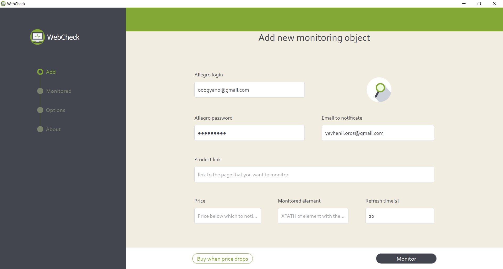
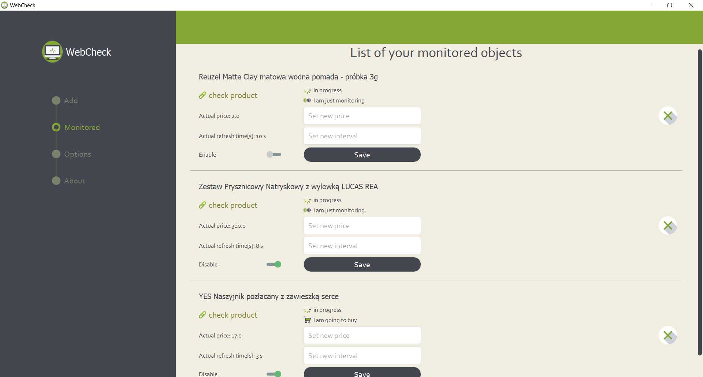
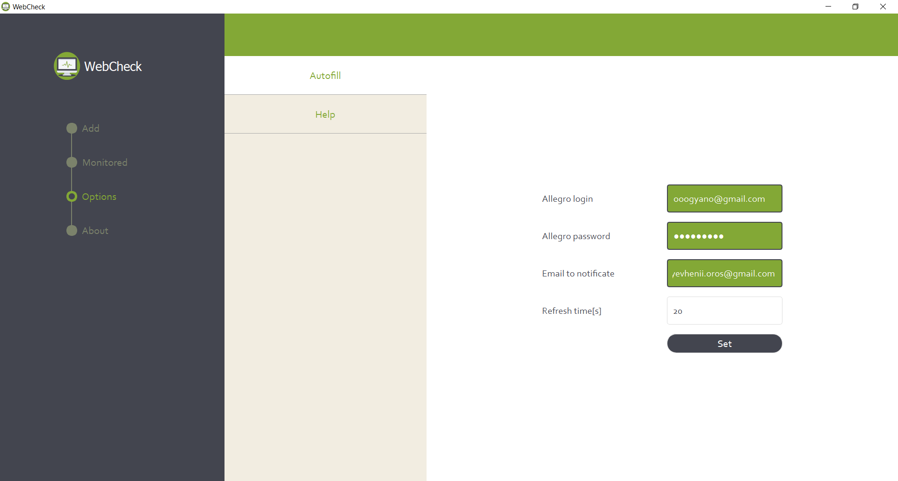
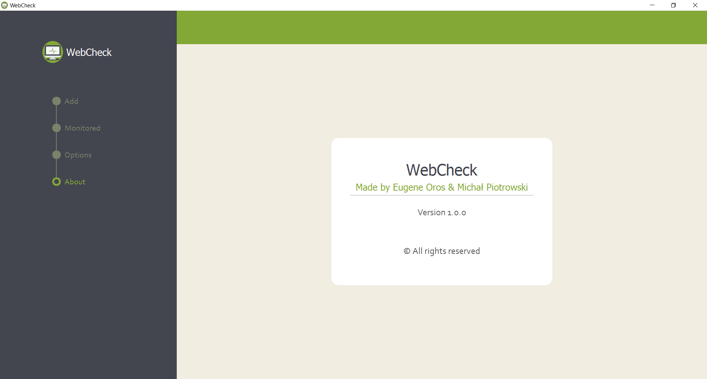

# WebCheck

## About
WebCheck is a desktop application to monitor the availability of the product on the Allegro website, and if it appears send an email notification. Generally, it was designed as a bot that gives you two main advantages: it is faster than the person sitting behind the monitor and trying to be the first one to buy the product, and also it is automatic

## Features
•Monitoring a certain product on the Alegro webpage 
•Login to webpage and buying product if a user selects this function 
•Disabaling and enabaling monitoring. Also changing some other parameters 
•Mailing to users if the price changed to wanted mark . 

## Libraries & Packages
WebCheck makes use of: 
∙ [PySide2](https://pypi.org/project/PySide2/) - for displaying GUI application 
∙ [selenium](https://pypi.org/project/selenium) - WebDriver, for example, Google Chrome 
∙ [multiprocessing](https://pypi.org/project/multiprocessing/) - with its help, we were able to simultaneously monitor the webpage and run the GUI application  
∙ [sendmail](https://pypi.org/project/sendmail/) - for sending email 

## Screenshots

